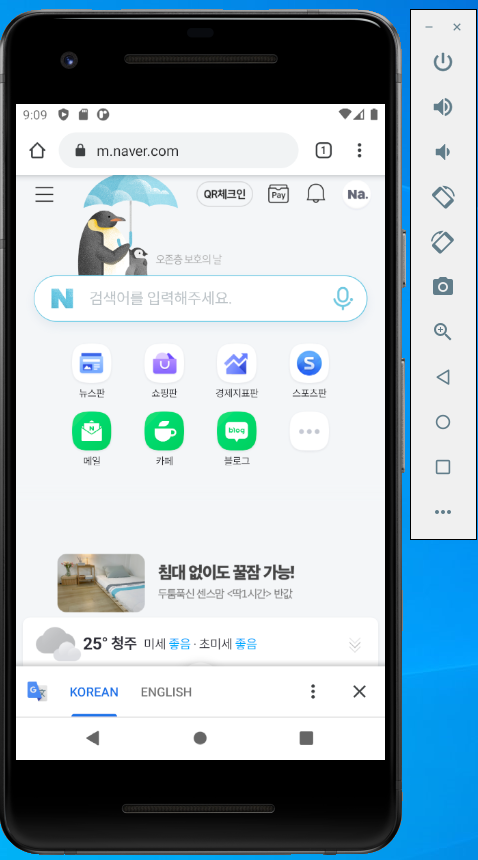
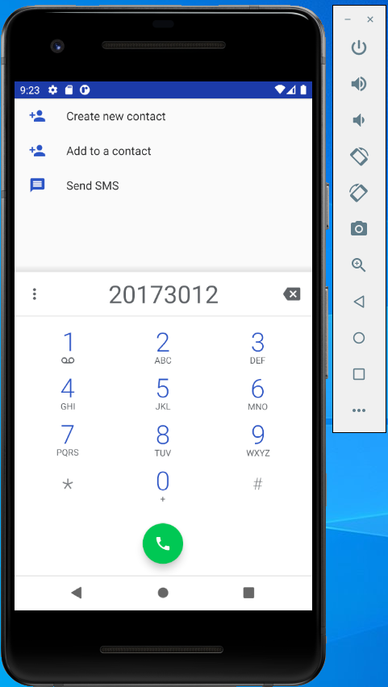
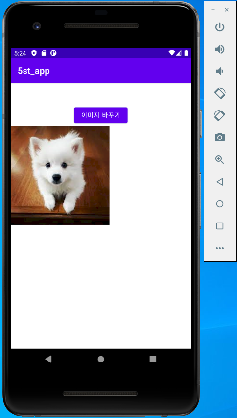
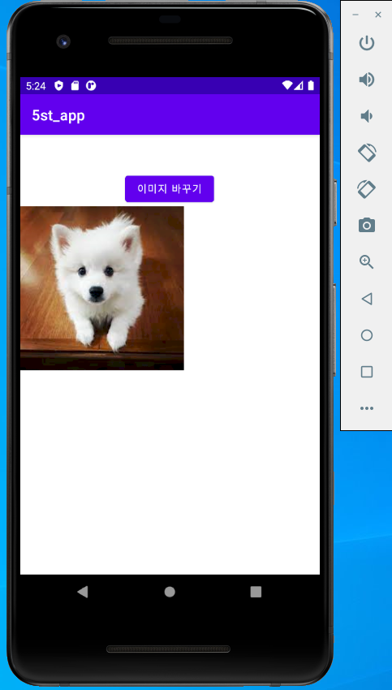
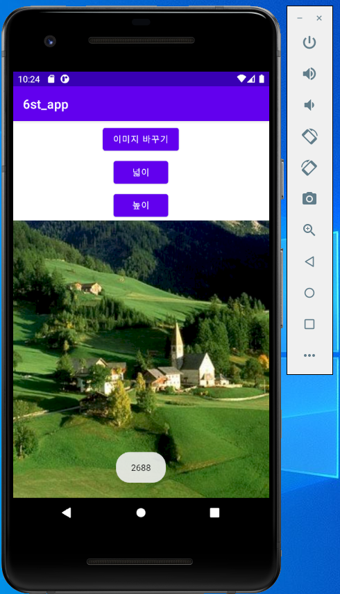
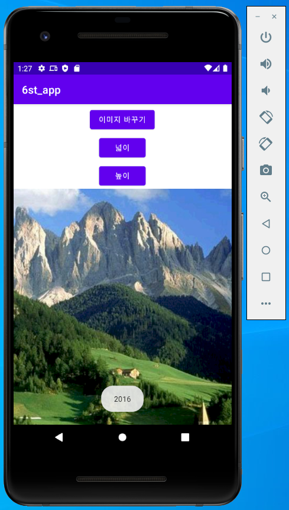
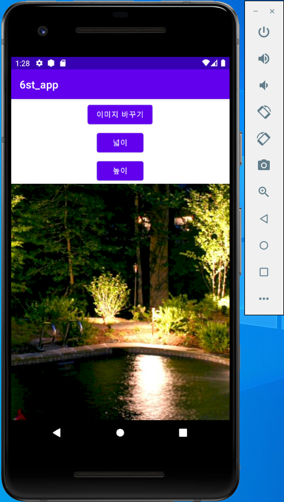
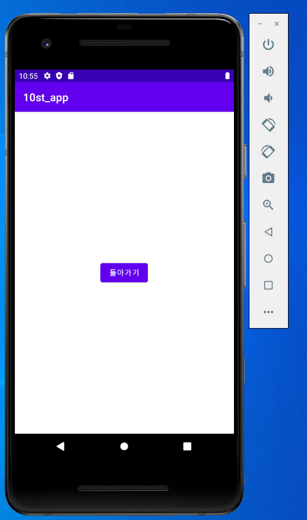
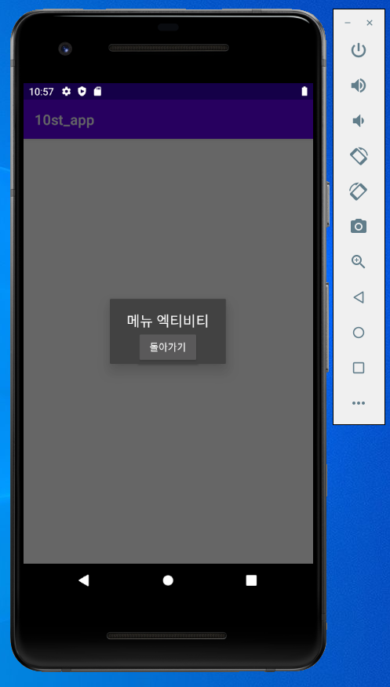
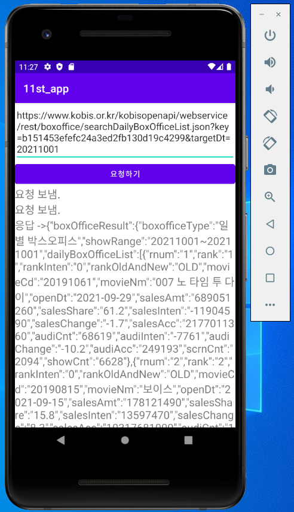

# 20173012_HSJ_androidApp

# 캡스톤 디자인 주간 A반

## 1주차

</img>

## 2주차

</img>

## 3주차
</img>
</img>

## 4주차
  아이디어: 펫 출입 가능 장소
  
  여행을 떠나거나 외식을 할 때 펫이 동반이 불가능하여 제약을 받는 경우가 많다. 
  강아지 출입 가능 장소를 보여주고 후기까지 볼 수 있도록 한다. 
  예약도 가능하며 여행 동선까지 추천해 준다면 펫을 키우는 사람들에게 많은 편안함을 줄 수 있을 것 같다.
  
  아이디어: 명품 오프라인 구매
  
  명품 샵에서 새벽부터 몇시간 씩 대기하는 사람들을 위한 앱이다. 
  가기전에 대기자, 제품 재고, 예약과 픽업이 가능하다면 편할 것 같다.
  온라인에서 구매하기 꺼려지는 명품들을 빠른 시간안에 직접보고 구매할 수 있다.
  
  ## 5주차
  </img>
  </img>
  
  ## 6주차
  </img>
  </img>
  </img>
  
  ## 9주차
  </img>
  </img>
  </img>

  ## 10주차
  </img>
  </img>
 
  ## 11주차
  </img>

